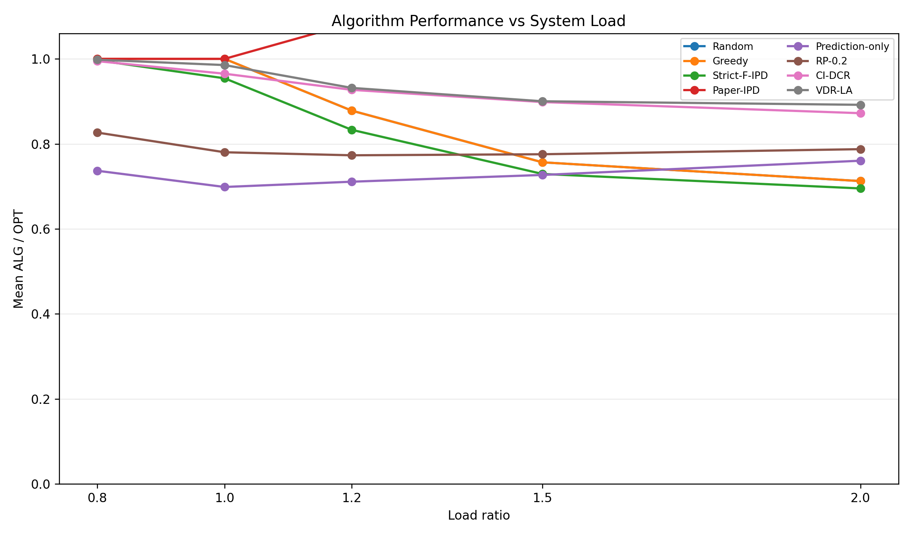
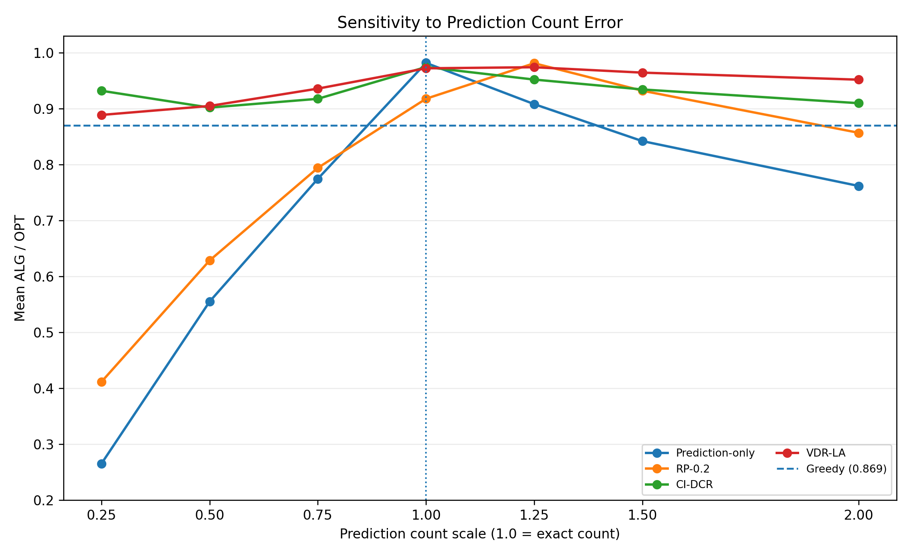
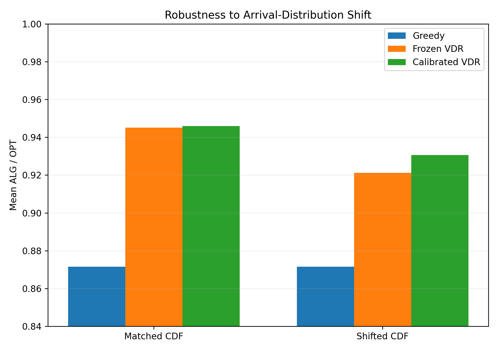
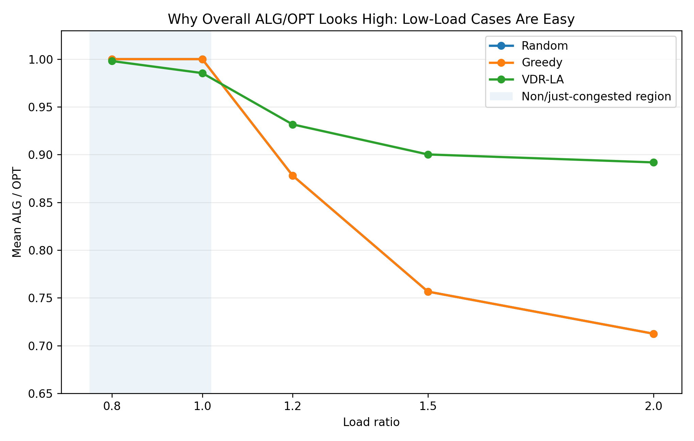
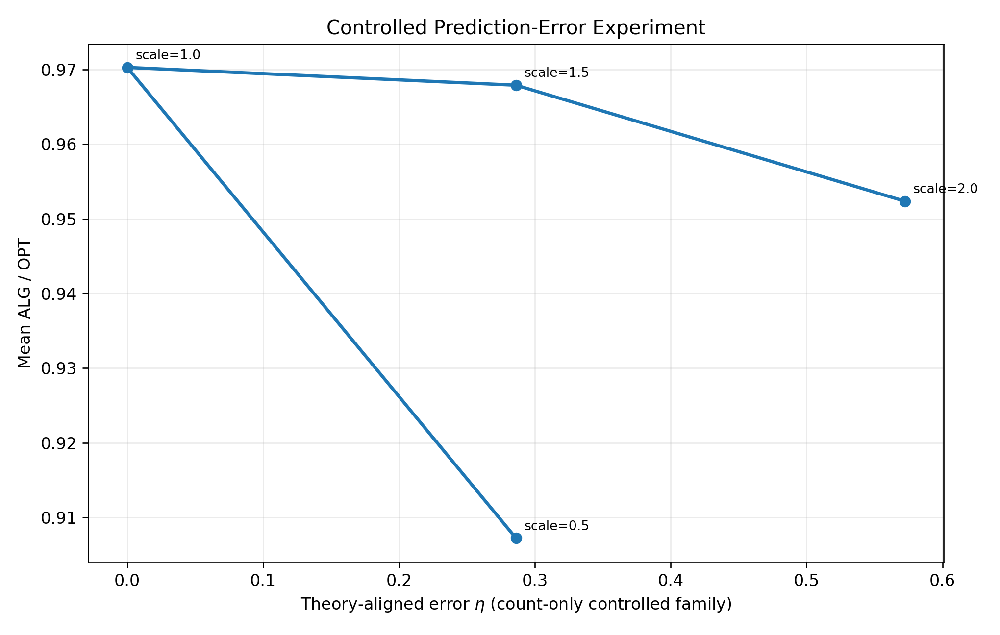
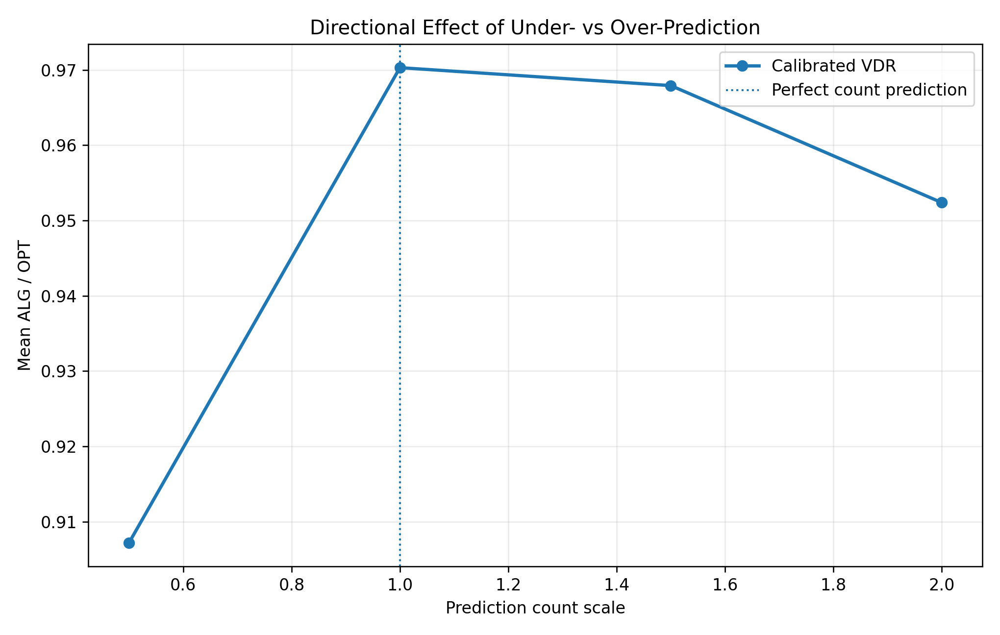

# Result Figures

This page collects the most interpretable figures for understanding the current VDR-LA journal route. The figures are intentionally selected to answer five questions: **When does prediction help? How much does load matter? How sensitive is VDR-LA to prediction error? What happens under arrival shift? Why should smoothness be asymmetric?**

## 1. Performance vs. system load

**What it shows.** Low-load cases are often easy enough that simple feasible policies can approach OPT, while the advantage of VDR-LA becomes meaningful as capacity becomes scarce. The paper should therefore emphasize congested regimes rather than claim pointwise dominance at every load.

## 2. Performance vs. prediction count scale

**What it shows.** Perfect prediction is strongest overall, but overprediction and underprediction are not equally harmful. The curve is one of the clearest pieces of evidence that a single symmetric prediction-error metric is insufficient for the final theory.

## 3. Arrival-distribution shift

**What it shows.** A shifted arrival CDF degrades the prediction-guided policy, while the one-sided online release recovers part of the loss. This is the most direct visual evidence for keeping the release mechanism in the frozen algorithm.

## 4. Random / Greedy / VDR-LA under increasing load

**What it shows.** At light load, assignment policy differences can be small. At high load, VDR-LA benefits from reserving scarce capacity for future high-value demand and separates from Random/Greedy.

## 5. Theory-aligned prediction error vs. performance

**What it shows.** Prediction quality matters, but the relationship is not well described by a single symmetric absolute error. This figure motivates a direction-aware smoothness analysis rather than a naive `ALG >= 1 - L eta` statement.

## 6. Underprediction vs. overprediction

**What it shows.** Missing future high-value demand is substantially more damaging than moderate overprediction. This supports separating prediction error into:

- `eta-`: missed / underpredicted future high-value demand;
- `eta+`: excess / overpredicted future high-value demand.

The current theoretical target is therefore an asymmetric smoothness bound, not a symmetric one.

---

## Recommended use in the paper

- **Main experimental figure:** Performance vs. system load.
- **Main learning-augmented figure:** Underprediction vs. overprediction.
- **Robustness figure:** Arrival-distribution shift.
- **Ablation/supporting figure:** Random / Greedy / VDR-LA under increasing load.
- **Theory-support figure:** Theory-aligned prediction error vs. performance.

The authoritative numerical snapshot remains [`JOURNAL_STATUS.md`](JOURNAL_STATUS.md), and compact CSV summaries are stored beside the figures under `docs/evidence/`.
